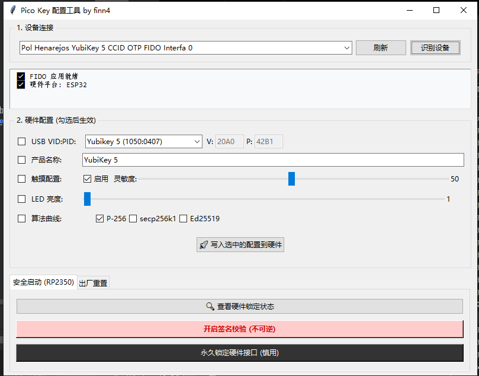
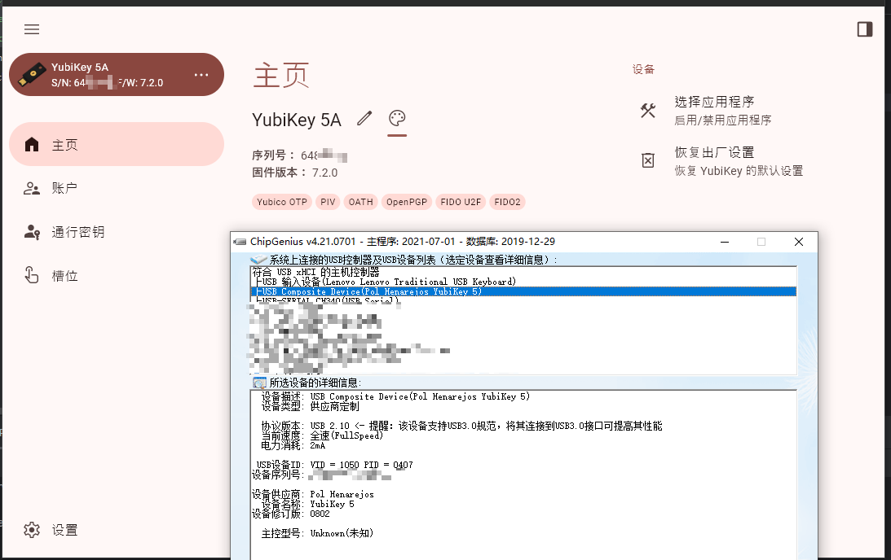

# FIDOConfigTool (FIDO 安全密钥固件的配置工具)

> **⚠️ 免责声明：**
> 
> **这是一个非官方的第三方开源工具，仅供学习使用，请勿用于非法用途，否则后果自负。**
> 

## 简介

**FIDOConfigTool** 是一个适用于 Pico FIDO 安全密钥固件的配置工具，使用 Python 编写。

刷入7.2的固件，仅在**ESP32 S3**测试过VID/PID、产品名称、LED亮度、出厂重置的功能。

## Credits

This project is heavily based on their work:
- [boku_no_key](https://github.com/Lumingtianze/boku_no_key)